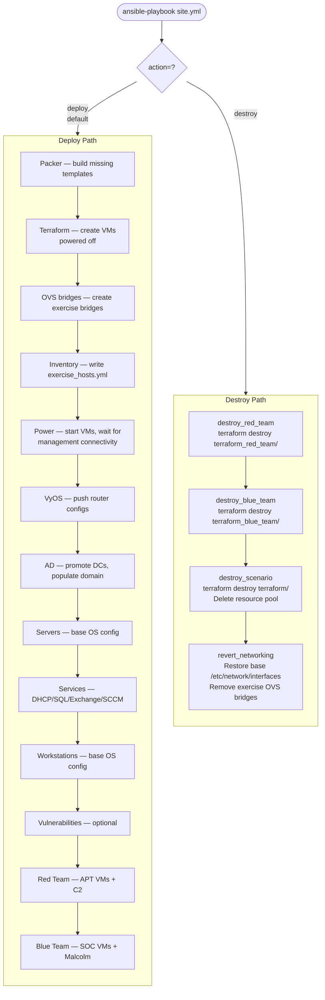

# CDX-E Deployment Workflow

This document describes the CDX-E exercise deployment pipeline, including the full
phase sequence, phase gate decision points, and deploy vs. destroy paths.

All phases are invoked by running `site.yml`. Individual playbooks can also be run
standalone for targeted operations — see [`playbooks/README.md`](playbooks/README.md).

---

## Full Pipeline Diagram

```mermaid
flowchart TD
    START([White Cell: ansible-playbook site.yml\n-e exercise=NAME]) --> P0

    subgraph P0["Phase 0 — Exercise Initiation (always)"]
        P0A[read_exercise_config\nLoad scenario.yml + vms.yaml\nSet cacheable facts]
    end

    P0 --> GATE1{scenario.phases.packer?}
    GATE1 -- false --> P2
    GATE1 -- true --> P1

    subgraph P1["Phase 1 — Template Deployment"]
        P1A[deploy_packer_template\nQuery Proxmox for existing templates] --> P1B{Missing templates?}
        P1B -- none --> P1C[Skip build — all templates exist]
        P1B -- some --> P1D[Run packer build\nfor each missing template] --> P1E[Validate templates\nregistered in Proxmox]
        P1C --> P1F
        P1E --> P1F[stage_templates\nFull-copy QNAP masters\nto per-node RAID storage]
    end

    P1 --> GATE2{scenario.phases.terraform?\naction=deploy?}
    GATE2 -- false or destroy --> GDESTROY{action=destroy?}
    GATE2 -- true --> P2

    subgraph P2["Phase 2 — VM Provisioning (Terraform)"]
        P2A[deploy_scenario\nGenerate main.tf from vms.yaml\nTerraform apply → VMs created,\npowered OFF]
    end

    P2 --> GATE_NET1{scenario.phases.networking?}
    GATE_NET1 -- false --> P2A_INV
    GATE_NET1 -- true --> P25

    subgraph P25["Phase 2.5 — Bridge Creation (pre-power-on)"]
        P25A[configure_networking\nscope=bridges\nCreate OVS bridges on Proxmox nodes\nSkip VyOS — routers not yet running]
    end

    P25 --> P2A_INV

    subgraph P2A["Phase 2a — Inventory Refresh"]
        P2A_INV[inventory_refresh\nRead Terraform outputs\nWrite inventory/exercise_hosts.yml\nRefresh in-memory inventory]
    end

    P2A --> P2B

    subgraph P2B["Phase 2b — VM Power Management"]
        P2B1[vm_power_management\nPre-check: skip already-running VMs] --> P2B2[POST /status/start\nfor each stopped VM]
        P2B2 --> P2B3[Wait: QEMU guest agent ping] --> P2B4[Query guest agent\nfor management IP]
        P2B4 --> P2B5{Cloud-init reboot\nin progress?}
        P2B5 -- yes, HTTP 500 --> P2B4
        P2B5 -- no, HTTP 200 --> P2B6[Wait: WinRM 5985 or SSH 22\non management IP]
        P2B6 --> P2B7[Write host_vars/VM.yml\nadd_host for in-memory update]
    end

    P2B --> GATE_NET2{scenario.phases.networking?}
    GATE_NET2 -- false --> GATE_DOM
    GATE_NET2 -- true --> P3

    subgraph P3["Phase 3 — Network Management (VMs running)"]
        P3A[configure_networking\nscope=all\nIdempotent bridge config\n+\nPush VyOS CLI configs via SSH]
    end

    P3 --> GATE_DOM{scenario.phases.domain?}
    GATE_DOM -- false --> GATE_SRV
    GATE_DOM -- true --> P4

    subgraph P4["Phase 4 — Domain Management (serial: 1)"]
        P4A[configure_vm\nHostname, timezone, WinRM] --> P4B[install_windowsfeature\nAD-Domain-Services, DNS, GPMC]
        P4B --> P4C{First DC?}
        P4C -- yes --> P4D[configure_active_directory\nNew forest + domain promotion]
        P4C -- no --> P4E[configure_active_directory\nReplica DC promotion]
        P4D --> P4F[configure_active_directory\nOUs, sites, subnets, users, groups]
        P4E --> P4F
        P4F --> P4G[deploy_group_policy_objects\nCreate GPOs, link to OUs,\napply registry settings]
    end

    P4 --> GATE_SRV{scenario.phases.servers?}
    GATE_SRV -- false --> GATE_SVC
    GATE_SRV -- true --> P5

    subgraph P5["Phase 5 — Server Configuration"]
        P5A[configure_vm] --> P5B[install_windowsfeature\nServer feature set]
    end

    P5 --> GATE_SVC

    subgraph GATE_SVC["Phase 6 — Domain Services (conditional per service)"]
        SVC1{services.dhcp?} -- true --> SVC1A[deploy_dhcp\nDHCP scopes + AD authorization]
        SVC2{services.sql?} -- true --> SVC2A[deploy_sql_server\nSQL unattended install]
        SVC3{services.exchange?\nrequires sql} -- true --> SVC3A[deploy_microsoft_exchange\nAD prep + Exchange install]
        SVC4{services.sccm?\nrequires sql} -- true --> SVC4A[deploy_configuration_manager\nADK + AD prep + SCCM install]
        SVC5{services.iis?} -- true --> SVC5A[install_windowsfeature\nIIS feature set]
    end

    GATE_SVC --> GATE_WKS{scenario.phases.workstations?}
    GATE_WKS -- false --> GATE_VULN
    GATE_WKS -- true --> P7

    subgraph P7["Phase 7 — Workstation Configuration"]
        P7A[configure_vm] --> P7B[install_windowsfeature\nWorkstation feature set]
    end

    P7 --> GATE_VULN{scenario.phases.vulnerabilities?}
    GATE_VULN -- false --> GATE_RT
    GATE_VULN -- true --> P8

    subgraph P8["Phase 8 — Vulnerability Deployment"]
        P8A[deploy_vulnerability\nInsecure configs for training objectives]
    end

    P8 --> GATE_RT

    GATE_RT{scenario.phases.red_team?}
    GATE_RT -- false --> GATE_BT
    GATE_RT -- true --> P9

    subgraph P9["Phase 9 — Red Team Deployment"]
        P9A[read_apt_config\nLoad APT profile] --> P9B[deploy_red_team\nTerraform: Red Team VMs\nState: terraform_red_team/]
        P9B --> P9C[vm_power_management\ntarget_tier=red_team] --> P9D[configure_red_team\nC2 platform config\nOperator tooling]
    end

    P9 --> GATE_BT{scenario.phases.blue_team?}
    GATE_BT -- false --> DONE
    GATE_BT -- true --> P10

    subgraph P10["Phase 10 — Blue Team Deployment"]
        P10A[read_soc_layout\nLoad SOC layout] --> P10B[deploy_blue_team\nTerraform: Blue Team VMs\nState: terraform_blue_team/]
        P10B --> P10C[vm_power_management\ntarget_tier=blue_team] --> P10D[configure_blue_team\nMalcolm, Hedgehog sensor,\nAnalyst workstations]
    end

    P10 --> DONE([Exercise Ready\nWhite Cell: run environment_check.yml])

    GDESTROY -- yes --> DTEAR

    subgraph DTEAR["Teardown (action=destroy)"]
        D1[destroy_red_team\nTerraform destroy terraform_red_team/] --> D2[destroy_blue_team\nTerraform destroy terraform_blue_team/]
        D2 --> D3[destroy_scenario\nTerraform destroy terraform/] --> D4[revert_networking\nRestore base /etc/network/interfaces\nRemove exercise OVS bridges]
    end

    DTEAR --> DONE2([Environment Cleared])
```



---

## Phase Gate Decision Tree

The following diagram shows only the phase gate logic, without internal role detail.

```mermaid
flowchart LR
    S([Start]) --> A0[Phase 0\nexercise_initiation\nalways runs]
    A0 --> A1{packer?}
    A1 -->|true| B1[Phase 1\ntemplate_deployment]
    A1 -->|false| A2
    B1 --> A2{terraform?}
    A2 -->|true| B2[Phase 2\nvm_management]
    A2 -->|false| A3
    B2 --> BNET1{networking?}
    BNET1 -->|true| BNB[Phase 2.5\nbridges only]
    BNET1 -->|false| A2A
    BNB --> A2A[Phase 2a\ninventory_refresh]
    A2A --> A2B[Phase 2b\nvm_power_management]
    A2B --> BNET2{networking?}
    BNET2 -->|true| BVYOS[Phase 3\nVyOS config]
    BNET2 -->|false| A3
    BVYOS --> A3{domain?}
    A3 -->|true| B4[Phase 4\ndomain_management]
    A3 -->|false| A5
    B4 --> A5{servers?}
    A5 -->|true| B5[Phase 5\nserver_configuration]
    A5 -->|false| A6
    B5 --> A6[Phase 6\ndomain_services\nper-service gates]
    A6 --> A7{workstations?}
    A7 -->|true| B7[Phase 7\nworkstation_configuration]
    A7 -->|false| A8
    B7 --> A8{vulnerabilities?}
    A8 -->|true| B8[Phase 8\nvulnerability_deployment]
    A8 -->|false| A9
    B8 --> A9{red_team?}
    A9 -->|true| B9[Phase 9\nred_team_deployment]
    A9 -->|false| A10
    B9 --> A10{blue_team?}
    A10 -->|true| B10[Phase 10\nblue_team_deployment]
    A10 -->|false| END([Done])
    B10 --> END
```



---

## Deploy vs. Destroy Paths



---

## Key Architectural Points

### IP Management

Two distinct IPs exist for every VM:

| IP Type | Key | Set by | Used by |
|---|---|---|---|
| **Exercise IP** | `cloud_init_ip` | `inventory_refresh` (from `vms.yaml`) | Service roles (DHCP auth, DNS config, etc.) |
| **Management IP** | `ansible_host` | `vm_power_management` (QEMU guest agent) | Ansible — all WinRM/SSH connections |

The management IP is the Layer0 DHCP address (net0). The exercise IP is the static IP
on the exercise-network NIC (net1). These are never the same. Roles that configure
network-facing services must use `cloud_init_ip`, not `ansible_host`.

### Fact Propagation

Facts set by loader roles are **cacheable** and flow across plays via `hostvars['localhost']`.
Each play imports them explicitly using `set_fact`:

```
read_exercise_config (localhost pre-play)
  → hostvars['localhost'].scenario
  → hostvars['localhost'].virtual_machines
  → imported by set_fact in each subsequent play
```

### Team VM Separation

Three independent Terraform state directories ensure team isolation:

```
EXERCISES/<name>/
├── terraform/             ← scenario VMs (Blue/defended network)
├── terraform_red_team/    ← APT/Red Team VMs
└── terraform_blue_team/   ← SOC/Blue Team VMs
```

Red Team and Blue Team can be deployed, destroyed, and re-deployed independently without
affecting scenario VMs.

### Standalone Playbook Use Cases

| Scenario | Playbook |
|---|---|
| Re-apply GPO changes | `domain_management.yml` |
| Add a new user to AD | `domain_management.yml` |
| Re-stage templates after QNAP rebuild | `template_staging.yml` |
| Deploy Red Team against existing exercise | `red_team_deployment.yml -e action=deploy` |
| Tear down only Red Team | `red_team_deployment.yml -e action=destroy` |
| Install SIEM agents post-exercise setup | `endpoint_agent_deployment.yml` |
| Validate network readiness | `environment_check.yml` |
| Re-configure VyOS routers | `network_management.yml -e action=deploy` |
| Add a new Exchange server | `exchange_management.yml` |
| Force rebuild a Packer template | `template_deployment.yml -e force_rebuild=true` |
